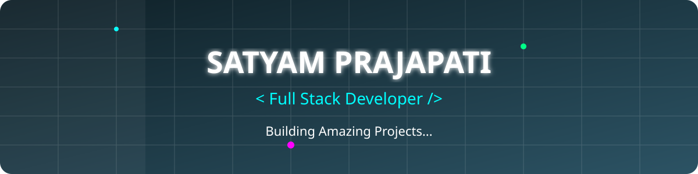

<!-- Tech Banner Image (Must exist in repo) -->

<!-- Visitor Counter -->
  

  

---

### 🚀 About Me

**From Gamer to AI Innovator**

My tech journey started at the age of 12 with gaming, which quickly evolved into a deep fascination with Web Development and SEO. Over the years, I leveled up my skills, transitioning into AI & Voice Agent Development and crafting compelling technical articles.

Today, at 18, I am a B.Tech CSE (AI/ML) student and the **Founder of Namstag AI**. I thrive on building scalable solutions, having successfully launched 3-4 SaaS products and a comprehensive Flutter-based study application. My mission is to bridge the gap between complex AI logic and intuitive user experiences, engineering the future one line of code at a time.

---

### 🎮 Pacman Contribution Graph

 
<picture>
  <source media="(prefers-color-scheme: dark)" srcset="https://raw.githubusercontent.com/SatyamPrajapati17/SatyamPrajapati17/pacman-output/pacman-contribution-graph-dark.svg?game=pacman">
  <source media="(prefers-color-scheme: light )" srcset="https://raw.githubusercontent.com/SatyamPrajapati17/SatyamPrajapati17/pacman-output/pacman-contribution-graph.svg?game=pacman">
  
</picture>

---

### 💻 Interactive Tech Stack

 

#### 🎨 Frontend

  

#### ⚙️ Backend

  

#### 🗄️ Database & Cloud

  

#### 🤖 AI, Automation & Tools

---

### 📊 GitHub Dynamics

 

  

  

---

### 🎯 Current Focus

- [x] Building AI & Voice Agents
- [ ] Mastering Full-Stack Development
- [ ] Deep Dive into DSA & Algorithms
- [ ] Building RAG & CI/CD Pipelines for LLMs
- [ ] Scaling SaaS Architectures

---

### 🌐 Connect with Me

